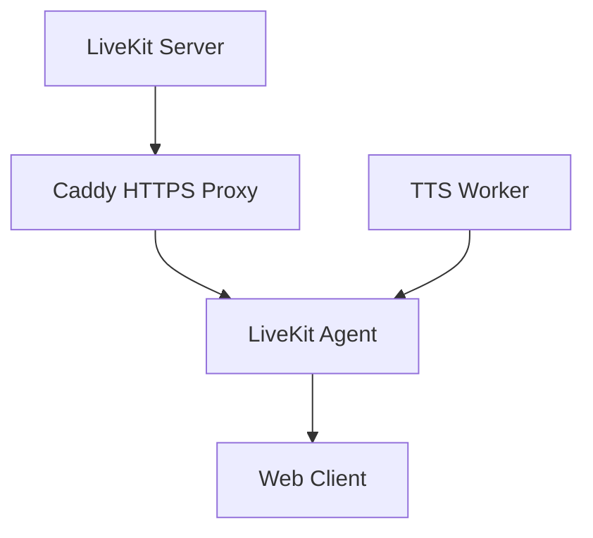

# Docker Unified Workflow Guide

**Last Updated**: 2025-10-17

This guide explains the unified development workflow that combines Honcho process manager, Docker Compose profiles, and Just commands for streamlined development.

---

## Table of Contents

1. [Overview](#overview)
2. [Quick Start](#quick-start)
3. [Architecture](#architecture)
4. [Unified Development Mode](#unified-development-mode)
5. [Docker Compose Profiles](#docker-compose-profiles)
6. [Model Switching](#model-switching)
7. [Environment Variables](#environment-variables)
8. [Advanced Scenarios](#advanced-scenarios)
9. [Troubleshooting](#troubleshooting)

---

## Overview

### The Problem This Solves

Previously, developers had to:
- Start 4-5 services manually in separate terminals
- Wait 5+ minutes for Docker Compose build
- Manage log files separately
- Restart each service individually after code changes

### The Solution

**Unified Development Workflow** provides:
- **Single command** to start all services (`just dev-agent-piper`)
- **10-second startup** (vs 5+ minutes for Docker)
- **Automatic logging** with timestamped session files
- **Color-coded output** for easy service identification
- **Graceful shutdown** with a single Ctrl+C

### Design Principles

1. **Fast iteration** - Minimize time between code change and test
2. **Production-like** - Use real services (LiveKit, Caddy, gRPC)
3. **Developer-friendly** - Color logs, auto-logging, easy debugging
4. **Cross-platform** - Works on Linux, macOS, WSL2
5. **Backward compatible** - Old workflows still work for debugging

---

## Quick Start

### Prerequisites

```bash
# Install uv (Python package manager)
curl -LsSf https://astral.sh/uv/install.sh | sh

# Install dependencies
uv sync --all-extras

# Generate gRPC stubs
just gen-proto
```

### 30-Second Demo

```bash
# Start all services in parallel
just dev-agent-piper

# Output example:
# Starting development services with LiveKit Agent + Custom Plugins...
# Services: LiveKit Server, Caddy, TTS Worker (Piper), LiveKit Agent
# Custom Plugins: WhisperX STT (4-8x faster), gRPC TTS (Piper)
# Logs: logs/dev-sessions/dev-agent-piper-20251017-143022.log
#
# Stop with: Ctrl+C (single press, waits up to 10s for graceful shutdown)
```

**Access Points:**
- Web client: https://localhost:8443
- LiveKit WebSocket: wss://localhost:8444
- Logs: `logs/dev-sessions/dev-agent-piper-YYYYMMDD-HHMMSS.log`

---

## Architecture

### Component Overview

```
┌─────────────────────────────────────────────────────────────────┐
│                      Unified Development Mode                     │
│                    (Honcho Process Manager)                       │
├──────────────┬──────────────┬──────────────┬────────────────────┤
│   LiveKit    │    Caddy     │  TTS Worker  │  LiveKit Agent     │
│   (Docker)   │   (Docker)   │   (Python)   │    (Python)        │
├──────────────┴──────────────┴──────────────┴────────────────────┤
│                      Service Discovery                            │
│                     (Redis - Optional)                            │
└───────────────────────────────────────────────────────────────────┘

Color-coded logs → Console + Timestamped file
```

### Service Dependencies



**Startup Order:**
1. LiveKit Server (Docker) - 2-3 seconds
2. Caddy HTTPS Proxy (Docker) - 1 second
3. TTS Worker (Python) - 5-6 seconds (model download on first run)
4. LiveKit Agent (Python) - 1 second
5. **Total: ~10 seconds**

### Log Flow

```
Honcho → Console (color-coded, real-time)
      → tee → logs/dev-sessions/dev-TIMESTAMP.log (persistent)
```

---

## Unified Development Mode

### Available Commands

```bash
# Recommended for most development
just dev-agent-piper  # LiveKit Agent + Piper TTS + WhisperX STT

# Legacy orchestrator (for comparison testing)
just dev              # Old WebSocket orchestrator + Piper TTS

# Include web client (Next.js dev server)
just dev-web          # Adds frontend on port 3000
```

### Command Breakdown

#### `just dev-agent-piper` (Recommended)

**What it starts:**
- **LiveKit Server**: WebRTC media server on ports 7880-7882
- **Caddy**: HTTPS/WSS reverse proxy on ports 8443/8444
- **TTS Worker**: Piper adapter (CPU) on port 7001
- **LiveKit Agent**: Custom STT/TTS/LLM orchestrator

**Custom Plugins:**
- `whisperx.STT`: 4-8x faster than standard Whisper
- `grpc_tts.TTS`: Connects to TTS worker (Piper adapter)
- `openai.LLM`: Uses OpenAI GPT (will be optional in future)

**Use Cases:**
- Full-stack development with speech-to-speech
- Testing LiveKit integration
- Realistic TTS with Piper voice models
- Performance benchmarking

**Environment Requirements:**
- `LIVEKIT_API_KEY`, `LIVEKIT_API_SECRET` in `.env`
- `OPENAI_API_KEY` in `.env` (for LLM, temporary)
- Piper model downloads ~60MB on first run (~30s)

#### `just dev` (Legacy)

**What it starts:**
- Same as above, but uses **old WebSocket orchestrator**
- For backward compatibility and comparison testing

**When to use:**
- Comparing old vs new orchestrator behavior
- Debugging WebSocket-specific issues
- Testing without OpenAI dependency

#### `just dev-web`

**What it adds:**
- Next.js development server on port 3000
- Frontend with React + LiveKit client SDK

**When to use:**
- Frontend development
- Full-stack integration testing
- UI/UX work

### Log Management

#### Automatic Logging

Every `just dev*` command automatically:
- Creates `logs/dev-sessions/` directory
- Generates timestamped log file
- Uses `tee` to output to both console and file
- Preserves ANSI color codes in log file

**Filename Format:**
```
logs/dev-sessions/dev-agent-piper-YYYYMMDD-HHMMSS.log
logs/dev-sessions/dev-YYYYMMDD-HHMMSS.log
logs/dev-sessions/dev-web-YYYYMMDD-HHMMSS.log
```

#### Viewing Logs

```bash
# List recent sessions (last 10)
just logs-list

# Tail most recent log (follow in real-time)
just logs-tail

# View specific log file
just logs-view dev-agent-piper-20251017-143022.log

# Search logs
grep -r "ERROR" logs/dev-sessions/
```

#### Cleaning Logs

```bash
# Clean old logs (keep last 20 sessions OR 7 days, whichever is more)
just logs-clean

# Output example:
# Cleaning old development session logs...
# Total log files: 35
# Keeping last 20 files, removing 15 old files...
# Deleted 3 log files older than 7 days.
# Remaining log files: 20
```

**Retention Policy:**
- Keep last 20 sessions (most recent files)
- Delete files older than 7 days
- Whichever keeps MORE files

### Graceful Shutdown

**Single Ctrl+C Behavior:**
1. Honcho sends SIGINT to all processes
2. Docker containers have `--stop-timeout 10` (10 seconds to clean up)
3. Python processes handle SIGINT gracefully
4. All processes exit within 10 seconds

**What Gets Cleaned Up:**
- Docker containers removed (`--rm` flag)
- Python processes terminated
- gRPC connections closed
- Log files flushed and saved

---

## Docker Compose Profiles

### Overview

Docker Compose profiles allow **selective service startup** for different scenarios.

### Available Profiles

#### Default Profile (No Profile)

```bash
docker compose up
```

**Services Started:**
- redis (service discovery)
- livekit (WebRTC server)
- caddy (HTTPS proxy)
- orchestrator (Python)
- tts0 (Piper TTS worker)

**Use Case:** Standard development and testing

#### CosyVoice Profile

```bash
docker compose --profile cosyvoice up
```

**Additional Service:**
- `tts-cosyvoice` (isolated PyTorch 2.3.1 environment)

**Why Isolated?**
- Main project uses PyTorch 2.7.0 + CUDA 12.8
- CosyVoice requires PyTorch 2.3.1 + CUDA 12.1
- Separate Dockerfile (`Dockerfile.tts-cosyvoice`) avoids conflicts

**Port Configuration:**
- gRPC: 7002 (vs 7001 for Piper)
- Metrics: 9091 (vs 9090 for Piper)

**Model Setup:**
```bash
# Download CosyVoice models
mkdir -p voicepacks/cosyvoice
# ... copy model files ...

# Start with profile
docker compose --profile cosyvoice up
```

### Combining Profiles

```bash
# Start both Piper and CosyVoice workers
docker compose --profile cosyvoice up

# Start only specific services
docker compose up redis livekit caddy
```

---

## Model Switching

### Development Mode (Honcho)

```bash
# Piper TTS (CPU, realistic speech)
just dev-agent-piper

# Legacy orchestrator
just dev
```

**How It Works:**
- `Procfile.agent` specifies TTS adapter: `--adapter piper`
- Can be customized by editing Procfile
- Restart `just dev-agent-piper` to apply changes

**Customizing Procfile:**

```bash
# Edit Procfile.agent
vim Procfile.agent

# Change TTS adapter line:
tts: uv run python -u -m src.tts --adapter piper --default-model piper-en-us-amy-low

# Restart development mode
just dev-agent-piper
```

### Docker Compose Mode

```bash
# Piper TTS (default)
docker compose up

# CosyVoice TTS (GPU, isolated)
docker compose --profile cosyvoice up

# Both workers (multi-model setup)
docker compose --profile cosyvoice up
```

**Environment Variables:**

```bash
# Set in .env or shell
export TTS_ADAPTER=piper
export DEFAULT_MODEL_ID=piper-en-us-lessac-medium

docker compose up --build
```

### Individual Services (Debugging)

```bash
# Piper adapter
just run-tts-piper DEFAULT="piper-en-us-lessac-medium"

# CosyVoice adapter (requires Docker)
just run-tts-cosy DEFAULT="cosyvoice2-en-base"

# Mock adapter (for testing)
just run-tts-mock
```

---

## Environment Variables

### Hierarchy

```
1. Shell environment (highest priority)
2. .env file
3. docker-compose.yml environment section
4. Config files (orchestrator.yaml, worker.yaml)
5. Code defaults (lowest priority)
```

### Required Variables

```bash
# LiveKit (for dev-agent-piper)
LIVEKIT_URL=ws://localhost:7880
LIVEKIT_API_KEY=devkey
LIVEKIT_API_SECRET=devsecret1234567890abcdefghijklmn

# OpenAI (temporary, for LLM)
OPENAI_API_KEY=sk-...

# Redis (optional, defaults work)
REDIS_URL=redis://localhost:6379
```

### Optional Variables

```bash
# TTS Configuration
TTS_ADAPTER=piper
DEFAULT_MODEL_ID=piper-en-us-lessac-medium
TTL_MS=600000
RESIDENT_CAP=3

# ASR Configuration
ASR_ENABLED=true
ASR_ADAPTER=whisperx
ASR_MODEL_SIZE=small
ASR_DEVICE=auto

# Logging
LOG_LEVEL=INFO
LOG_FORMAT=text

# GPU
CUDA_VISIBLE_DEVICES=0
```

### `.env` File Example

```bash
# .env (create at repository root)

# LiveKit
LIVEKIT_URL=ws://localhost:7880
LIVEKIT_API_KEY=devkey
LIVEKIT_API_SECRET=devsecret1234567890abcdefghijklmn

# OpenAI (temporary)
OPENAI_API_KEY=sk-proj-...

# Redis
REDIS_URL=redis://localhost:6379

# TTS
DEFAULT_MODEL_ID=piper-en-us-lessac-medium

# ASR
ASR_ADAPTER=whisperx
ASR_MODEL_SIZE=small

# Logging
LOG_LEVEL=INFO
```

---

## Advanced Scenarios

### Multi-GPU Development

```bash
# Terminal 1: Worker 0 on GPU 0
CUDA_VISIBLE_DEVICES=0 just run-tts-piper

# Terminal 2: Worker 1 on GPU 1 (future: CosyVoice)
CUDA_VISIBLE_DEVICES=1 just run-tts-cosy

# Terminal 3: Orchestrator (discovers both workers)
just run-orch
```

**Service Discovery:**
- Workers register with Redis on startup
- Orchestrator queries Redis for available workers
- Routing based on model capabilities (M9 planned)

### Hybrid Mode (Docker + Bare Metal)

```bash
# Start infrastructure in Docker
docker compose up -d redis livekit caddy

# Run workers on bare metal (for debugging)
just run-tts-piper
just run-agent
```

**Use Case:**
- Debug TTS worker with py-spy profiling
- Hot-reload Python code without Docker rebuild
- Access to local GPU without Docker runtime overhead

### Production Deployment

```bash
# Build optimized Docker images
docker compose -f docker-compose.prod.yml build

# Start with resource limits
docker compose -f docker-compose.prod.yml up -d

# Monitor logs
docker compose logs -f orchestrator tts0
```

**Production Differences:**
- Use production config files
- Enable TLS/HTTPS everywhere
- Set strong API keys/secrets
- Resource limits (CPU, memory, GPU)
- Restart policies (always, unless-stopped)

---

## Troubleshooting

### Common Issues

#### Port Already in Use

**Symptom:**
```
Error: bind: address already in use
```

**Solution:**
```bash
# Find process using port
lsof -i :7880  # LiveKit
lsof -i :7001  # TTS Worker
lsof -i :8443  # Caddy HTTPS

# Kill process
kill -9 <PID>

# Or stop all Docker containers
docker stop $(docker ps -q)
```

#### Docker Container Conflicts

**Symptom:**
```
Error: container name already in use
```

**Solution:**
```bash
# Remove existing containers
docker stop livekit-dev-honcho caddy-dev-honcho
docker rm livekit-dev-honcho caddy-dev-honcho

# Or force recreation
just dev-agent-piper
```

#### Honcho Not Found

**Symptom:**
```
bash: honcho: command not found
```

**Solution:**
```bash
# Install honcho
uv sync --all-extras

# Or manually
uv pip install honcho

# Verify installation
uv run honcho --version
```

#### Model Download Fails

**Symptom:**
```
Failed to download piper-en-us-lessac-medium.onnx
```

**Solution:**
```bash
# Check network connection
curl -I https://huggingface.co/

# Download manually
mkdir -p voicepacks/piper
cd voicepacks/piper
wget https://huggingface.co/.../piper-en-us-lessac-medium.onnx

# Verify file exists
ls -lh voicepacks/piper/
```

#### Logs Not Being Created

**Symptom:**
- No `logs/dev-sessions/` directory
- Empty log files

**Solution:**
```bash
# Create directory manually
mkdir -p logs/dev-sessions

# Check write permissions
ls -ld logs/dev-sessions

# Verify tee command exists
which tee

# Check disk space
df -h
```

#### Graceful Shutdown Hangs

**Symptom:**
- Ctrl+C doesn't stop services
- Processes hang for >10 seconds

**Solution:**
```bash
# Force kill honcho
just dev-kill

# Or manually
pkill -f "honcho start"

# Stop Docker containers
docker stop livekit-dev-honcho caddy-dev-honcho
```

### Debug Mode

```bash
# Enable verbose logging
export LOG_LEVEL=DEBUG
export GRPC_VERBOSITY=debug

# Run with debug logs
just dev-agent-piper

# Check service health
curl http://localhost:7880/  # LiveKit
curl http://localhost:8443/  # Caddy (HTTPS)
```

### Performance Issues

#### Slow Startup

**Symptom:**
- Startup takes >30 seconds

**Possible Causes:**
1. First-time model download (Piper: ~60MB, ~30s)
2. Docker image pull (first run only)
3. Slow disk I/O (WSL2 with antivirus)

**Solution:**
```bash
# Pre-download models
mkdir -p voicepacks/piper
# ... download model files ...

# Pre-pull Docker images
docker pull livekit/livekit-server:latest
docker pull caddy:2-alpine

# Disable antivirus exclusion for project directory (WSL2)
```

#### High CPU Usage

**Symptom:**
- CPU usage > 80% during idle

**Possible Causes:**
1. VAD processing audio continuously
2. Multiple TTS workers running
3. Background model loading

**Solution:**
```bash
# Check running processes
ps aux | grep "python -m src"

# Stop unused workers
pkill -f "src.tts"

# Monitor CPU usage
top -p $(pgrep -f "src.orchestrator")
```

---

## Migration from Old Workflow

### Old Workflow (Manual Terminals)

```bash
# Terminal 1
just redis

# Terminal 2
just run-tts-piper

# Terminal 3
just run-orch

# Terminal 4
just cli
```

**Drawbacks:**
- 4 separate terminals to manage
- Manual log aggregation
- Difficult to correlate logs by timestamp
- No automatic cleanup

### New Workflow (Unified)

```bash
# Single terminal
just dev-agent-piper

# Everything starts automatically
# Logs automatically captured
# Single Ctrl+C stops everything
```

**Benefits:**
- 1 terminal instead of 4
- Color-coded logs for easy debugging
- Automatic log files with timestamps
- Graceful shutdown with one command

### Command Mapping

| Old Command | New Command | Notes |
|-------------|-------------|-------|
| `just redis` | (automatic) | Started by Honcho |
| `docker compose up livekit` | (automatic) | Started by Honcho |
| `just run-tts-piper` | (automatic) | Started by Honcho |
| `just run-orch` | (automatic) | Started by Honcho |
| `just cli` | (still separate) | For testing WebSocket |
| `docker compose up --build` | `docker compose up` | No change |

### What to Delete

**Old files to remove:**
```bash
# Old shell scripts (if any)
rm scripts/start-dev-services.sh
rm scripts/stop-dev-services.sh

# Old Procfile variants (if migrated)
# Keep Procfile.dev and Procfile.agent
```

**What to keep:**
- `justfile` - Updated with new commands
- `docker-compose.yml` - Updated with profiles
- `Procfile.dev` - Unified workflow definition
- `Procfile.agent` - LiveKit Agent workflow
- All config files (`configs/`)

### Rollback Procedure

If the new workflow doesn't work:

```bash
# Use individual services (old workflow still works)
just redis
just run-tts-piper
just run-orch

# Or use Docker Compose
docker compose up

# Report issues with:
# - OS and version
# - Python version
# - Error messages from logs
# - Output of `just dev-agent-piper`
```

---

## Summary

### Key Takeaways

1. **Use `just dev-agent-piper` for most development** - 10 second startup, auto-logging
2. **Docker Compose profiles for model switching** - `--profile cosyvoice` for GPU models
3. **Logs automatically saved** - `logs/dev-sessions/` with timestamps
4. **Single Ctrl+C stops everything** - Graceful shutdown within 10 seconds
5. **Honcho manages processes** - Industry-standard Procfile format
6. **Old workflows still work** - For debugging and comparison

### Next Steps

1. Try `just dev-agent-piper` - Experience the unified workflow
2. Review logs - `just logs-list`, `just logs-tail`
3. Customize Procfile - Edit `Procfile.agent` for different models
4. Read [DEVELOPMENT.md](DEVELOPMENT.md) - Comprehensive development guide

---

**Questions or Issues?**
- See [DEVELOPMENT.md](DEVELOPMENT.md) for troubleshooting
- Check [known-issues/](known-issues/) for common problems
- File an issue with logs from `logs/dev-sessions/`
