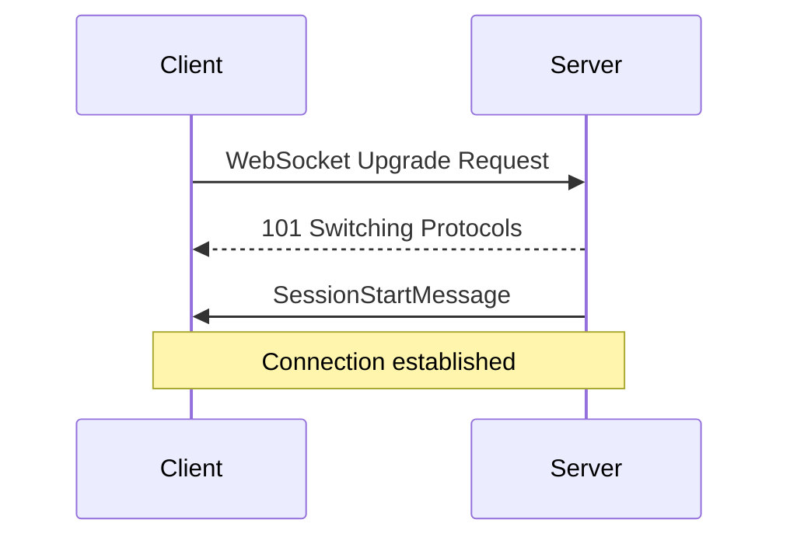
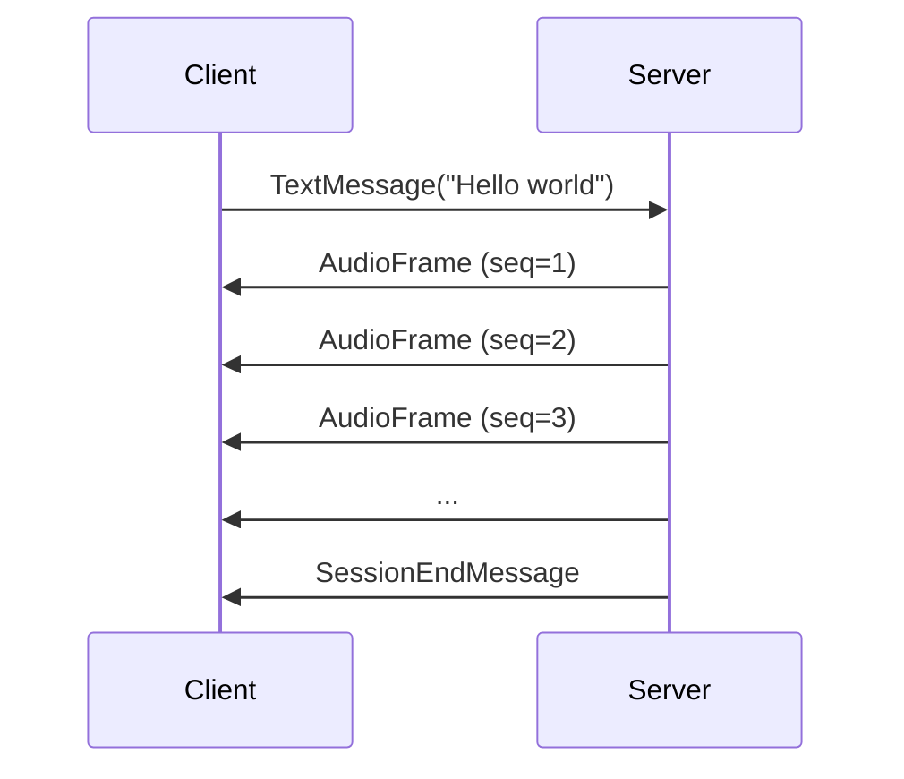
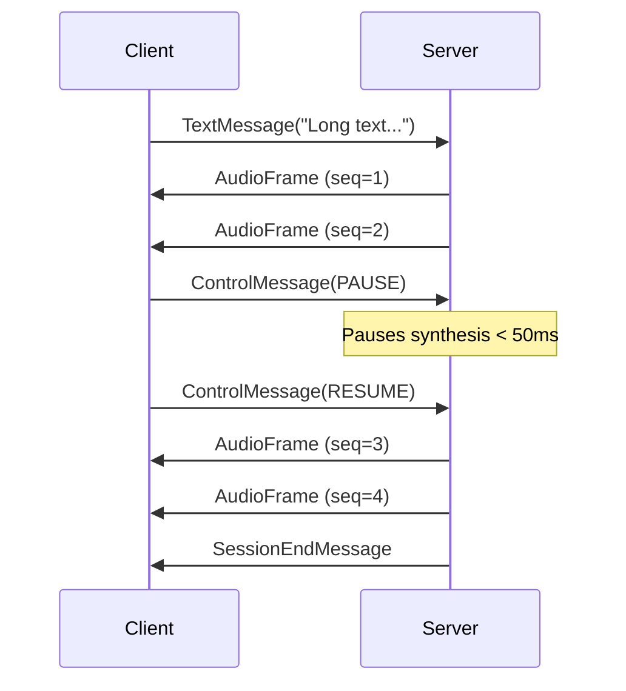

# WebSocket Protocol Specification

## Overview

The WebSocket protocol provides a simple JSON-based interface for real-time text-to-speech synthesis with barge-in support. This specification enables external integrators to build compatible clients in any language.

**Connection Endpoint:** `ws://localhost:8080` (default)

**Message Format:** JSON-encoded text frames

**Protocol Features:**
- Bidirectional streaming communication
- Real-time audio frame delivery (20ms @ 48kHz)
- Session management and control
- Low-latency barge-in support (PAUSE/RESUME)

---

## Connection Flow

### 1. Connection Handshake



The server automatically sends a `SessionStartMessage` upon successful connection.

### 2. Normal Synthesis Flow



### 3. Barge-In Flow



---

## Message Types

### Client → Server Messages

#### TextMessage

Send text for TTS synthesis.

**Schema:**
```json
{
  "type": "text",
  "text": "string (min_length=1)",
  "is_final": "boolean (default: true)"
}
```

**Fields:**
- `type`: Must be `"text"`
- `text`: Text to synthesize (required, minimum 1 character)
- `is_final`: Whether this is the final chunk in a sequence (optional, default: `true`)

**Example:**
```json
{
  "type": "text",
  "text": "Hello, this is a test of the text-to-speech system.",
  "is_final": true
}
```

#### ControlMessage

Send control commands to manage synthesis playback.

**Schema:**
```json
{
  "type": "control",
  "command": "PAUSE | RESUME | STOP"
}
```

**Fields:**
- `type`: Must be `"control"`
- `command`: One of:
  - `"PAUSE"` - Pause audio synthesis (< 50ms latency)
  - `"RESUME"` - Resume paused synthesis
  - `"STOP"` - Stop current synthesis and clear queue

**Example:**
```json
{
  "type": "control",
  "command": "PAUSE"
}
```

---

### Server → Client Messages

#### SessionStartMessage

Sent when a new session is established.

**Schema:**
```json
{
  "type": "session_start",
  "session_id": "string (UUID)"
}
```

**Fields:**
- `type`: Always `"session_start"`
- `session_id`: Unique session identifier (UUID format)

**Example:**
```json
{
  "type": "session_start",
  "session_id": "550e8400-e29b-41d4-a716-446655440000"
}
```

#### AudioMessage

Contains a single 20ms PCM audio frame.

**Schema:**
```json
{
  "type": "audio",
  "pcm": "string (base64)",
  "sample_rate": "integer (default: 48000)",
  "frame_ms": "integer (default: 20)",
  "sequence": "integer (>= 1)"
}
```

**Fields:**
- `type`: Always `"audio"`
- `pcm`: Base64-encoded PCM audio data (16-bit signed integers, 1920 bytes = 960 samples @ 48kHz)
- `sample_rate`: Sample rate in Hz (default: 48000)
- `frame_ms`: Frame duration in milliseconds (default: 20)
- `sequence`: Sequence number for ordering frames (starts at 1)

**Example:**
```json
{
  "type": "audio",
  "pcm": "AAEAAv//AAH//wAC//8AAf//AAL//wAB...",
  "sample_rate": 48000,
  "frame_ms": 20,
  "sequence": 1
}
```

**PCM Format:**
- **Encoding:** 16-bit signed little-endian PCM
- **Channels:** Mono (1 channel)
- **Sample Rate:** 48000 Hz
- **Frame Size:** 20ms = 960 samples = 1920 bytes

**Decoding PCM:**
```python
import base64
import numpy as np

pcm_base64 = audio_message["pcm"]
pcm_bytes = base64.b64decode(pcm_base64)
audio_array = np.frombuffer(pcm_bytes, dtype=np.int16)
# Normalize to float32 [-1, 1] for playback
audio_float = audio_array.astype(np.float32) / 32768.0
```

#### SessionEndMessage

Sent when a session terminates.

**Schema:**
```json
{
  "type": "session_end",
  "session_id": "string (UUID)",
  "reason": "string (default: 'completed')"
}
```

**Fields:**
- `type`: Always `"session_end"`
- `session_id`: Session identifier
- `reason`: Reason for termination (e.g., "completed", "client_disconnect", "error")

**Example:**
```json
{
  "type": "session_end",
  "session_id": "550e8400-e29b-41d4-a716-446655440000",
  "reason": "completed"
}
```

#### ErrorMessage

Sent when an error occurs during the session.

**Schema:**
```json
{
  "type": "error",
  "message": "string",
  "code": "string (default: 'INTERNAL_ERROR')"
}
```

**Fields:**
- `type`: Always `"error"`
- `message`: Human-readable error description
- `code`: Error code for programmatic handling

**Common Error Codes:**
- `INTERNAL_ERROR` - Internal server error
- `INVALID_MESSAGE` - Malformed message received
- `WORKER_UNAVAILABLE` - TTS worker not available
- `SYNTHESIS_FAILED` - TTS synthesis failed
- `CONNECTION_ERROR` - Network/connection error

**Example:**
```json
{
  "type": "error",
  "message": "TTS worker is not available. Check worker connectivity.",
  "code": "WORKER_UNAVAILABLE"
}
```

---

## Code Examples

### Python Client (asyncio + websockets)

```python
import asyncio
import base64
import json
import numpy as np
import websockets

async def simple_tts_client():
    """Simple WebSocket TTS client example."""
    uri = "ws://localhost:8080"

    async with websockets.connect(uri) as websocket:
        # Receive session start message
        msg = await websocket.recv()
        session_data = json.loads(msg)
        print(f"Session started: {session_data['session_id']}")

        # Send text for synthesis
        text_msg = {
            "type": "text",
            "text": "Hello, this is a test of the text-to-speech system.",
            "is_final": True
        }
        await websocket.send(json.dumps(text_msg))

        # Receive and process audio frames
        frame_count = 0
        async for message in websocket:
            data = json.loads(message)

            if data["type"] == "audio":
                # Decode PCM data
                pcm_bytes = base64.b64decode(data["pcm"])
                audio_array = np.frombuffer(pcm_bytes, dtype=np.int16)
                print(f"Received frame {data['sequence']}: {len(audio_array)} samples")
                frame_count += 1

            elif data["type"] == "session_end":
                print(f"Session ended: {data['reason']}")
                print(f"Total frames received: {frame_count}")
                break

            elif data["type"] == "error":
                print(f"Error [{data['code']}]: {data['message']}")
                break

# Run the client
asyncio.run(simple_tts_client())
```

### Python Client with Barge-In

```python
import asyncio
import json
import websockets

async def barge_in_example():
    """Example demonstrating pause/resume control."""
    uri = "ws://localhost:8080"

    async with websockets.connect(uri) as websocket:
        # Wait for session start
        session_msg = await websocket.recv()
        print(f"Connected: {json.loads(session_msg)['session_id']}")

        # Start synthesis
        text_msg = {"type": "text", "text": "A very long text that takes time to synthesize..."}
        await websocket.send(json.dumps(text_msg))

        # Receive a few frames
        for _ in range(3):
            msg = await websocket.recv()
            data = json.loads(msg)
            if data["type"] == "audio":
                print(f"Frame {data['sequence']}")

        # Pause synthesis
        pause_msg = {"type": "control", "command": "PAUSE"}
        await websocket.send(json.dumps(pause_msg))
        print("Paused synthesis")

        # Wait a bit
        await asyncio.sleep(2)

        # Resume synthesis
        resume_msg = {"type": "control", "command": "RESUME"}
        await websocket.send(json.dumps(resume_msg))
        print("Resumed synthesis")

        # Continue receiving frames
        async for message in websocket:
            data = json.loads(message)
            if data["type"] == "audio":
                print(f"Frame {data['sequence']}")
            elif data["type"] == "session_end":
                print("Session complete")
                break

asyncio.run(barge_in_example())
```

### JavaScript Client (Browser)

```javascript
class TTSWebSocketClient {
  constructor(url = 'ws://localhost:8080') {
    this.url = url;
    this.ws = null;
    this.sessionId = null;
    this.audioContext = new AudioContext({ sampleRate: 48000 });
  }

  connect() {
    return new Promise((resolve, reject) => {
      this.ws = new WebSocket(this.url);

      this.ws.onopen = () => {
        console.log('WebSocket connected');
      };

      this.ws.onmessage = (event) => {
        const data = JSON.parse(event.data);
        this.handleMessage(data);

        if (data.type === 'session_start') {
          this.sessionId = data.session_id;
          resolve();
        }
      };

      this.ws.onerror = (error) => {
        console.error('WebSocket error:', error);
        reject(error);
      };

      this.ws.onclose = () => {
        console.log('WebSocket disconnected');
      };
    });
  }

  handleMessage(data) {
    switch (data.type) {
      case 'session_start':
        console.log(`Session started: ${data.session_id}`);
        break;

      case 'audio':
        this.playAudioFrame(data);
        break;

      case 'session_end':
        console.log(`Session ended: ${data.reason}`);
        break;

      case 'error':
        console.error(`Error [${data.code}]: ${data.message}`);
        break;
    }
  }

  playAudioFrame(audioData) {
    // Decode base64 PCM
    const pcmBase64 = audioData.pcm;
    const pcmBinary = atob(pcmBase64);
    const pcmArray = new Int16Array(pcmBinary.length / 2);

    for (let i = 0; i < pcmArray.length; i++) {
      const byte1 = pcmBinary.charCodeAt(i * 2);
      const byte2 = pcmBinary.charCodeAt(i * 2 + 1);
      pcmArray[i] = (byte2 << 8) | byte1;
    }

    // Convert to float32 for Web Audio API
    const float32Array = new Float32Array(pcmArray.length);
    for (let i = 0; i < pcmArray.length; i++) {
      float32Array[i] = pcmArray[i] / 32768.0;
    }

    // Create audio buffer and play
    const audioBuffer = this.audioContext.createBuffer(1, float32Array.length, 48000);
    audioBuffer.getChannelData(0).set(float32Array);

    const source = this.audioContext.createBufferSource();
    source.buffer = audioBuffer;
    source.connect(this.audioContext.destination);
    source.start();

    console.log(`Playing frame ${audioData.sequence}`);
  }

  sendText(text) {
    const message = {
      type: 'text',
      text: text,
      is_final: true
    };
    this.ws.send(JSON.stringify(message));
  }

  sendControl(command) {
    const message = {
      type: 'control',
      command: command  // 'PAUSE', 'RESUME', or 'STOP'
    };
    this.ws.send(JSON.stringify(message));
  }

  disconnect() {
    if (this.ws) {
      this.ws.close();
    }
  }
}

// Usage example
async function main() {
  const client = new TTSWebSocketClient('ws://localhost:8080');
  await client.connect();

  client.sendText('Hello from JavaScript!');

  // Optionally pause after 2 seconds
  setTimeout(() => {
    client.sendControl('PAUSE');
    console.log('Paused');

    // Resume after another 2 seconds
    setTimeout(() => {
      client.sendControl('RESUME');
      console.log('Resumed');
    }, 2000);
  }, 2000);
}

main().catch(console.error);
```

---

## Error Handling Patterns

### Client-Side Error Handling

**Best Practices:**

1. **Always handle connection errors:**
```python
try:
    async with websockets.connect(uri) as websocket:
        # ... client logic
except websockets.exceptions.ConnectionRefused:
    print("Cannot connect to server. Is the orchestrator running?")
except websockets.exceptions.InvalidURI:
    print("Invalid WebSocket URI")
except Exception as e:
    print(f"Unexpected error: {e}")
```

2. **Handle unexpected disconnections:**
```python
try:
    async for message in websocket:
        # ... process message
except websockets.exceptions.ConnectionClosed:
    print("Server closed the connection")
    # Implement reconnection logic if needed
```

3. **Validate server messages:**
```python
try:
    data = json.loads(message)
    msg_type = data.get("type")

    if msg_type == "error":
        # Handle error gracefully
        print(f"Server error: {data['message']}")
        # Take corrective action based on error code
        if data["code"] == "WORKER_UNAVAILABLE":
            # Wait and retry
            await asyncio.sleep(5)

except json.JSONDecodeError:
    print("Received invalid JSON from server")
```

4. **Implement timeouts:**
```python
try:
    message = await asyncio.wait_for(websocket.recv(), timeout=30.0)
except asyncio.TimeoutError:
    print("Server response timeout")
```

### Server-Side Error Codes

| Code | Meaning | Client Action |
|------|---------|---------------|
| `INTERNAL_ERROR` | Server internal error | Retry after delay |
| `INVALID_MESSAGE` | Malformed client message | Fix message format |
| `WORKER_UNAVAILABLE` | TTS worker not ready | Wait and retry |
| `SYNTHESIS_FAILED` | TTS generation failed | Try different text |
| `CONNECTION_ERROR` | Network/gRPC error | Check connectivity |

---

## Protocol Constraints

### Message Size Limits

- **TextMessage:** Maximum 10,000 characters per message
- **AudioMessage:** Fixed 1920 bytes per frame (20ms @ 48kHz mono)
- **Total message size:** < 10 MB per JSON message

### Timing Constraints

- **Barge-in latency:** < 50ms from PAUSE to synthesis stop (p95)
- **Frame delivery:** 20ms cadence (50 frames/second)
- **Session timeout:** 5 minutes of inactivity

### Concurrency Limits

- **Max connections per orchestrator:** Configured in `orchestrator.yaml` (default: 100)
- **Max concurrent sessions per worker:** Configured in `worker.yaml` (default: 3)

---

## Testing Your Client

### 1. Connection Test

Verify that you can establish a WebSocket connection and receive the session start message:

```bash
# Using websocat
websocat ws://localhost:8080

# Expected response:
# {"type":"session_start","session_id":"..."}
```

### 2. Simple Synthesis Test

Send a text message and verify audio frames are received:

```bash
echo '{"type":"text","text":"Hello world","is_final":true}' | websocat ws://localhost:8080
```

### 3. Control Command Test

Test pause/resume functionality:

1. Send text message
2. Send pause command after receiving a few frames
3. Verify no more frames arrive
4. Send resume command
5. Verify frames resume

### 4. Error Handling Test

Send invalid messages to verify error handling:

```bash
# Missing required field
echo '{"type":"text"}' | websocat ws://localhost:8080
# Expected: error message with INVALID_MESSAGE code
```

---

## Troubleshooting

### Connection Issues

**Problem:** Cannot connect to WebSocket server

**Solutions:**
1. Verify orchestrator is running: `docker ps` or `just run-orch`
2. Check correct port (default: 8080)
3. Verify no firewall blocking connections
4. Check logs: `docker logs orchestrator` or console output

### No Audio Frames

**Problem:** Session starts but no audio frames received

**Solutions:**
1. Check TTS worker status: `docker ps | grep tts-worker`
2. Verify Redis is running: `docker ps | grep redis`
3. Check worker connectivity in orchestrator logs
4. Verify text message format is correct

### Frame Sequence Gaps

**Problem:** Missing sequence numbers in audio frames

**Solutions:**
1. Check network stability
2. Verify WebSocket message queue not overflowing
3. Increase `frame_queue_size` in orchestrator config
4. Check for backpressure in client receiving loop

---

## Related Documentation

- [Quick Start Guide](QUICKSTART.md) - Get up and running quickly
- [CLI Client Usage Guide](CLI_CLIENT_GUIDE.md) - Command-line client reference
- [Configuration Reference](CONFIGURATION_REFERENCE.md) - Orchestrator and worker configuration
- [API Reference](API_REFERENCE.md) - Complete API documentation
- [Architecture](architecture/ARCHITECTURE.md) - System architecture diagrams

---

## Changelog

**v0.2.0 (M2):**
- Initial WebSocket protocol implementation
- Support for text synthesis and control commands
- 20ms @ 48kHz PCM audio streaming
- Session management

**Future:**
- Model selection in SessionStart (M4+)
- Sample rate negotiation (M3+)
- Binary audio frames option (M5+)
- Metrics and stats messages (M9+)
