# System Architecture

## Overview

The Realtime Duplex Voice Demo is a two-tier streaming architecture designed for low-latency speech↔speech conversations with barge-in support.

**Architecture Principles:**
- **Modular:** Orchestrator and TTS workers run as separate processes
- **Scalable:** Single-GPU to multi-GPU and multi-host deployments
- **Pluggable:** Multiple TTS models via unified streaming ABI
- **Resilient:** Redis-based service discovery with health monitoring
- **Low-latency:** < 50ms barge-in, < 300ms first audio latency (GPU)

---

## Table of Contents

- [System Architecture Diagram](#system-architecture-diagram)
- [Component Overview](#component-overview)
- [WebSocket Flow Sequence](#websocket-flow-sequence)
- [gRPC Streaming Flow](#grpc-streaming-flow)
- [Session State Machine](#session-state-machine)
- [Deployment Topologies](#deployment-topologies)
- [Data Flow](#data-flow)
- [Barge-In Architecture](#barge-in-architecture)

---

## System Architecture Diagram

### High-Level Components

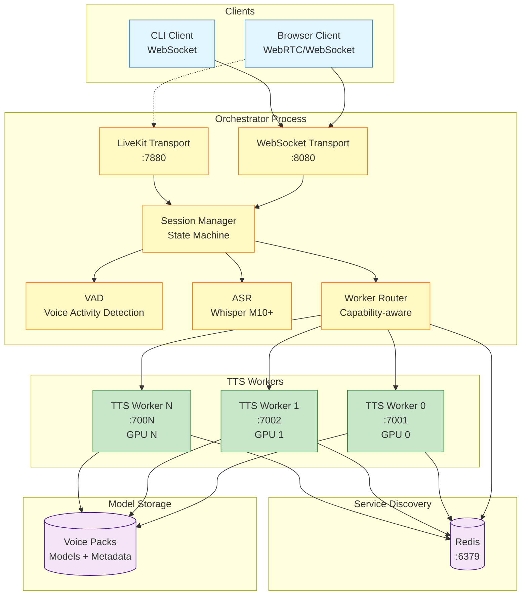

**Component Responsibilities:**

| Component | Responsibility | Port |
|-----------|---------------|------|
| **Browser Client** | Web UI, WebRTC audio | - |
| **CLI Client** | Command-line testing | - |
| **WebSocket Transport** | JSON message protocol | 8080 |
| **LiveKit Transport** | WebRTC streaming (M3+) | 7880 |
| **VAD** | Speech detection for barge-in | - |
| **ASR** | Speech-to-text (M10+) | - |
| **Worker Router** | Load balancing, routing | - |
| **Session Manager** | State machine, coordination | - |
| **Redis** | Service discovery, registry | 6379 |
| **TTS Workers** | gRPC synthesis servers | 7001+ |
| **Voice Packs** | Model files + metadata | - |

---

## Component Overview

### Orchestrator

**Purpose:** Client-facing service managing sessions and routing requests.

**Key Modules:**
- `transport/`: WebSocket and LiveKit transport implementations
- `vad.py`: Voice activity detection for barge-in
- `asr.py`: Automatic speech recognition (M10+)
- `routing.py`: Worker selection and load balancing
- `registry.py`: Redis-based worker discovery
- `server.py`: Main orchestrator entry point

**Configuration:** `configs/orchestrator.yaml`

**Scaling:** Typically one per deployment, can run multiple for HA

---

### TTS Worker

**Purpose:** GPU-accelerated TTS synthesis with model lifecycle management.

**Key Modules:**
- `worker.py`: gRPC server and adapter host
- `model_manager.py`: Model load/unload, TTL eviction (M4+)
- `tts_base.py`: Adapter interface protocol
- `adapters/`: Model-specific implementations
- `audio/`: Frame repacketization, normalization

**Configuration:** `configs/worker.yaml`

**Scaling:** One per GPU (or multiple per GPU for small models)

---

### Redis

**Purpose:** Service discovery, worker registry, health tracking.

**Data Structures:**
```
worker:<worker-name> → JSON metadata (TTL: 30s)
{
  "name": "tts-worker-0",
  "addr": "grpc://tts-worker:7002",
  "capabilities": {...},
  "resident_models": [...],
  "metrics": {...}
}
```

**Operations:**
- Worker registration on startup
- Heartbeat refresh every 10s
- Orchestrator queries for available workers
- Stale worker eviction after TTL expires

---

## WebSocket Flow Sequence

### Connection and Synthesis

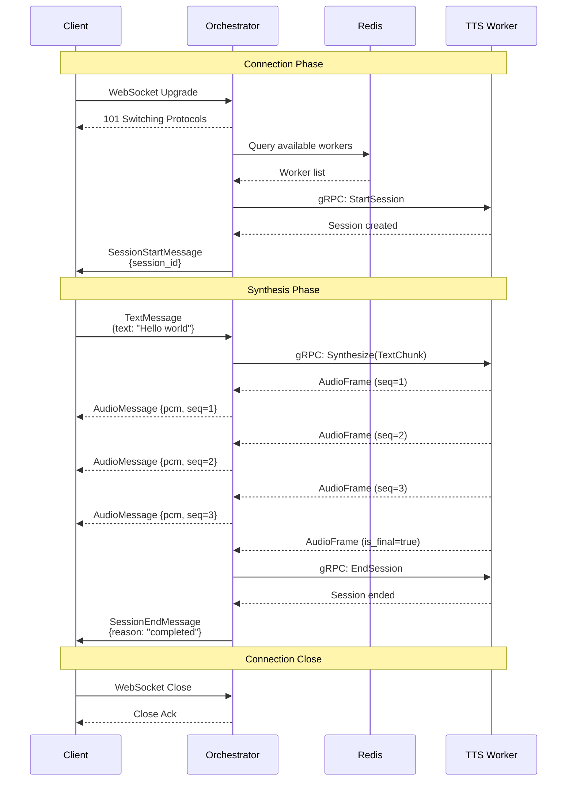

### Error Handling

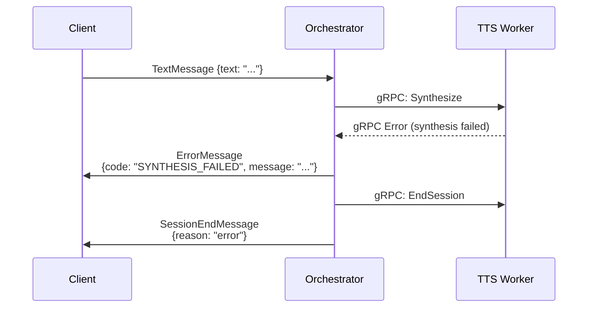

---

## gRPC Streaming Flow

### Orchestrator → Worker Communication

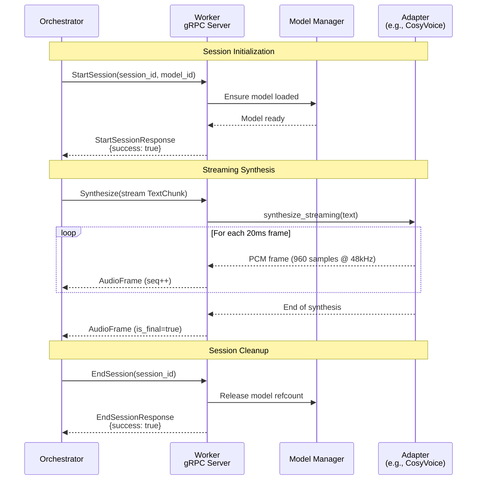

### Control Commands (Barge-In)

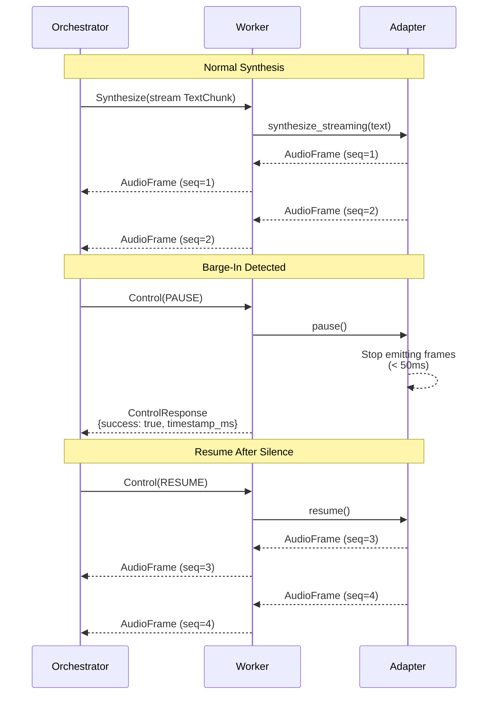

---

## Session State Machine

### Orchestrator Session States

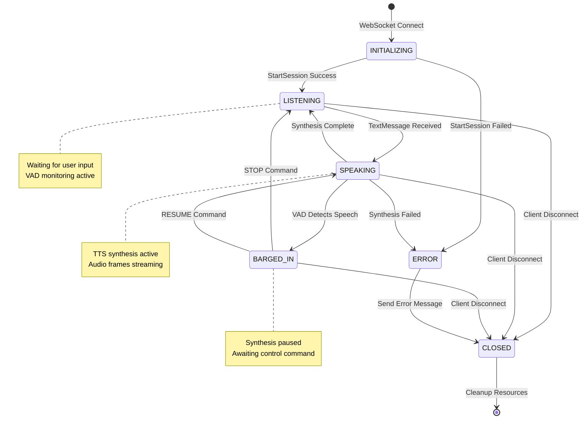

**State Descriptions:**

| State | Description | Valid Transitions |
|-------|-------------|-------------------|
| **INITIALIZING** | Session starting, connecting to worker | LISTENING, ERROR |
| **LISTENING** | Idle, waiting for text input | SPEAKING, CLOSED |
| **SPEAKING** | TTS synthesis in progress | LISTENING, BARGED_IN, ERROR, CLOSED |
| **BARGED_IN** | Synthesis paused due to interruption | LISTENING, SPEAKING, CLOSED |
| **ERROR** | Error occurred during session | CLOSED |
| **CLOSED** | Session terminated | (final state) |

---

## Deployment Topologies

### Single-GPU Development (M2 Current)

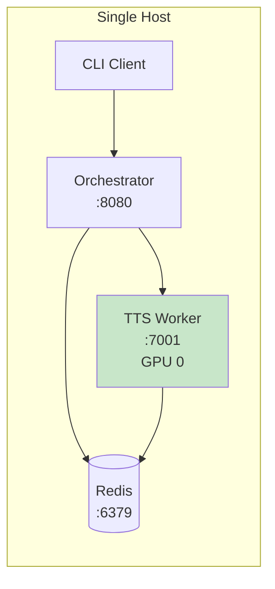

**Use Case:** Development, testing, demos

**Resources:** 1 GPU, 8GB+ VRAM

**Command:**
```bash
docker compose up --build
```

---

### Multi-GPU Same Host (M9+)

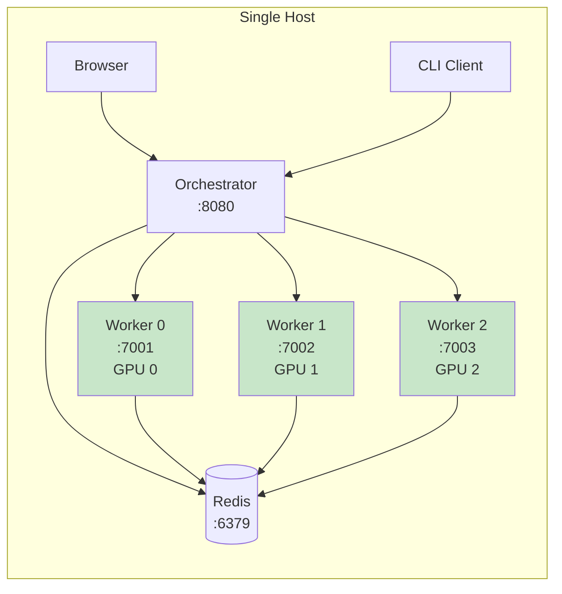

**Use Case:** Production, high throughput

**Resources:** 3+ GPUs, 24GB+ VRAM each

**Setup:**
```bash
# Worker 0 on GPU 0
CUDA_VISIBLE_DEVICES=0 just run-tts-cosy

# Worker 1 on GPU 1
CUDA_VISIBLE_DEVICES=1 just run-tts-xtts

# Worker 2 on GPU 2
CUDA_VISIBLE_DEVICES=2 just run-tts-sesame
```

---

### Multi-Host LAN Deployment (M13)

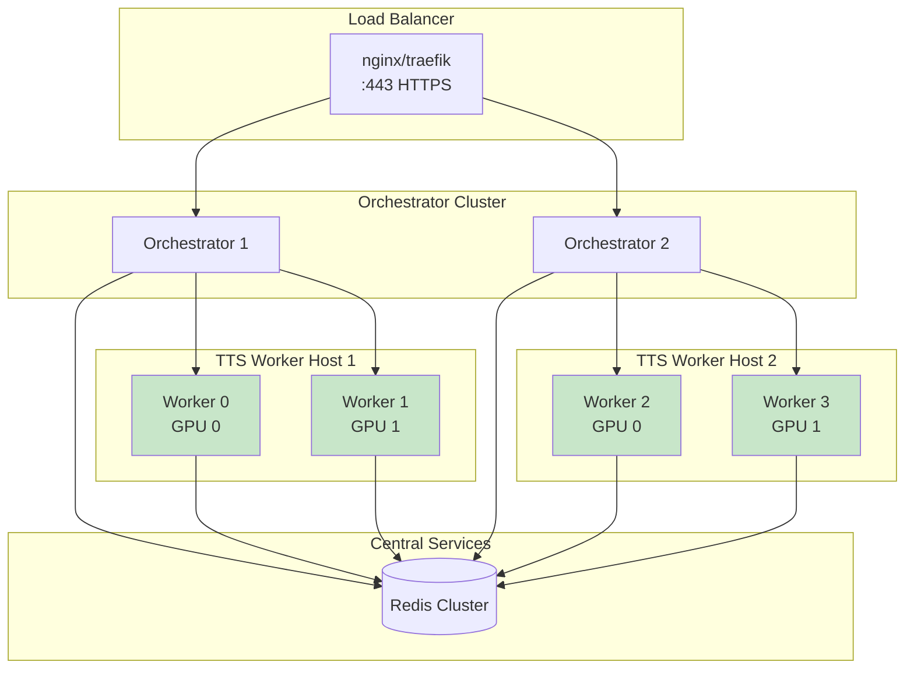

**Use Case:** Enterprise, high availability

**Resources:** Multiple hosts, distributed GPUs

**Features:**
- Load balancing across orchestrators
- Redis cluster for HA
- Cross-host worker discovery
- Automatic failover

---

## Data Flow

### Audio Frame Pipeline

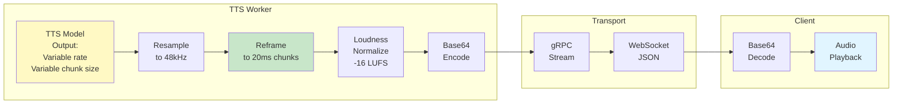

**Frame Specifications:**
- **Sample Rate:** 48000 Hz (fixed)
- **Frame Duration:** 20 ms (960 samples)
- **Format:** 16-bit signed PCM, little-endian
- **Channels:** Mono (1 channel)
- **Frame Size:** 1920 bytes
- **Encoding:** Base64 for WebSocket transport
- **Target Loudness:** -16 LUFS

---

## Barge-In Architecture

### Barge-In Timing Diagram

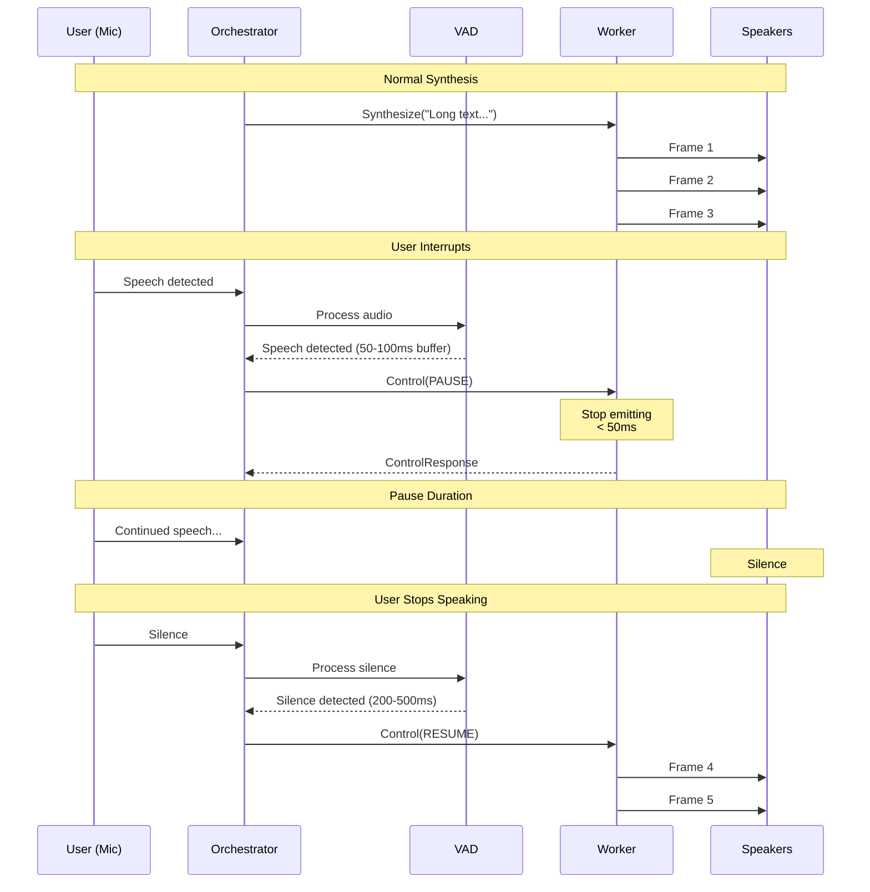

**Latency Budget:**

| Stage | Latency | Target |
|-------|---------|--------|
| VAD Detection | 10-30ms | < 50ms |
| Network (Orch→Worker) | 1-5ms | < 10ms |
| Worker Pause Processing | 2-10ms | < 20ms |
| **Total Pause Latency** | **13-45ms** | **< 50ms (p95)** |

---

### VAD Configuration Impact

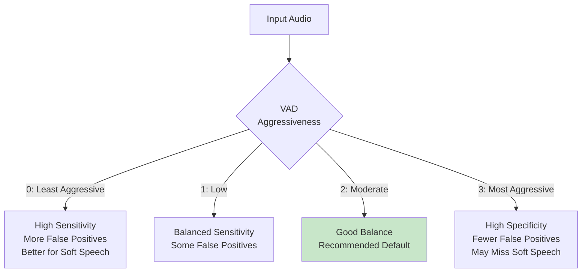

**Tuning Guidelines:**
- **Noisy Environment:** Use aggressiveness = 3
- **Quiet Environment:** Use aggressiveness = 1
- **General Use:** Use aggressiveness = 2 (default)

---

## Model Manager Architecture (M4+)

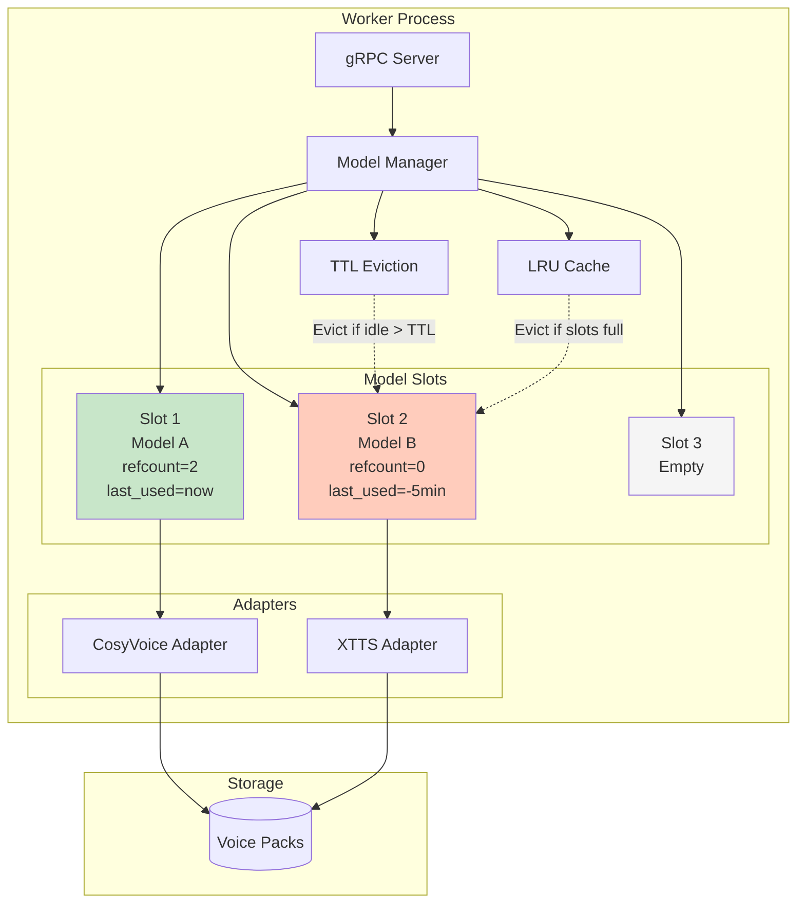

**Model Manager Operations:**

1. **Load Model:**
   - Check if already resident → return
   - Check resident_cap → evict LRU if needed
   - Load from voice pack
   - Warmup (~300ms synthetic utterance)
   - Register in slots

2. **Eviction Logic:**
   - Check every `evict_check_interval_ms` (30s)
   - Evict if: `refcount == 0` AND `idle_time > ttl_ms`
   - Respect `min_residency_ms` (prevent thrashing)
   - LRU eviction when `resident_count > resident_cap`

3. **Reference Counting:**
   - Increment on session start
   - Decrement on session end
   - Never evict if `refcount > 0`

---

## Network Protocols

### WebSocket Protocol Stack

```
┌─────────────────────────────────────┐
│         Application Layer           │
│    JSON Messages (Text/Audio)       │
├─────────────────────────────────────┤
│         WebSocket Layer             │
│       RFC 6455 Framing              │
├─────────────────────────────────────┤
│          HTTP/1.1 Upgrade           │
│       (Connection Handshake)        │
├─────────────────────────────────────┤
│            TCP Layer                │
│          Port 8080                  │
└─────────────────────────────────────┘
```

### gRPC Protocol Stack

```
┌─────────────────────────────────────┐
│       Application Layer             │
│    Protobuf Messages (Binary)       │
├─────────────────────────────────────┤
│          gRPC Layer                 │
│   Bidirectional Streaming RPC       │
├─────────────────────────────────────┤
│          HTTP/2 Layer               │
│     Multiplexing, Flow Control      │
├─────────────────────────────────────┤
│            TCP Layer                │
│         Ports 7001+                 │
└─────────────────────────────────────┘
```

---

## Security Architecture (Production)

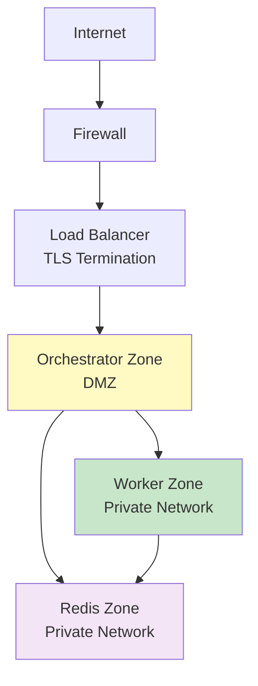

**Security Layers:**

| Component | Security Measure | Implementation |
|-----------|-----------------|----------------|
| **Load Balancer** | TLS termination | Let's Encrypt, nginx |
| **Orchestrator** | API key auth | Header validation |
| **gRPC (Orch→Worker)** | mTLS (optional) | Certificate validation |
| **Redis** | AUTH password | Redis ACL |
| **Network** | Private VLANs | Firewall rules |
| **Secrets** | Environment vars | Vault, AWS Secrets Manager |

---

## Related Documentation

- [WebSocket Protocol Specification](../WEBSOCKET_PROTOCOL.md) - Message format details
- [Configuration Reference](../CONFIGURATION_REFERENCE.md) - System configuration
- [Component READMEs](../../src/README.md) - Module documentation
- [Quick Start Guide](../QUICKSTART.md) - Deployment walkthrough
- [Performance Guide](../PERFORMANCE.md) - Tuning and optimization

---

## Changelog

**v0.2.0 (M2):**
- Initial architecture documentation
- System component diagram
- WebSocket and gRPC flow diagrams
- Session state machine
- Deployment topology examples

**Future:**
- M3: LiveKit WebRTC architecture
- M4: Model Manager detailed architecture
- M9: Multi-worker routing architecture
- M13: Multi-host scaling architecture
